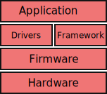

Flight Software 
===============

.. _Architecture:

Architecture
------------
The flight software is a stack of layers, each of which (theoretically) could be swapped out for a different implementation.

At the very bottom we have the hardware, this includes your PCB's, IMU, Microcontroller, etc...

The next layer is the firmware, this includes the following: 

* `CircuitPython <https://circuitpython.org>`_, which is a easy to use Python implementation meant to be run on a microcontroller.
* Various other bits of C/C++ to set up communication between the microcontroller and the CircuitPython VM.

Then there is the Driver/Framework layer. 
These two **should not** communicate with each other.

The Driver Layer defines functions used to communicate with components such as the radio, IMU, magnetometer, sun sensors, etc...

The Framework Layer is responsible for Scheduling and Running various tasks.
It does this by reading from a state machine config file, where each state contains a list of tasks and the frequencies they are run at.
It is also responsbile for switching between tasks while one is waiting on something (such as the radio to recieve something).

The Application Layer defines the Tasks, and configures the state machine to run them at the desired frequencies.
It is also responsible for telling the framework to switch states.
This is where all the complex logic and mission specific details will go.

Ideally the Application Layer should work independently of the underlying layers.
This enables swapping out the lower layers and thus easily emulating the opperations of the sattelite.
Thus the lower layers are made to be as simple as possible.