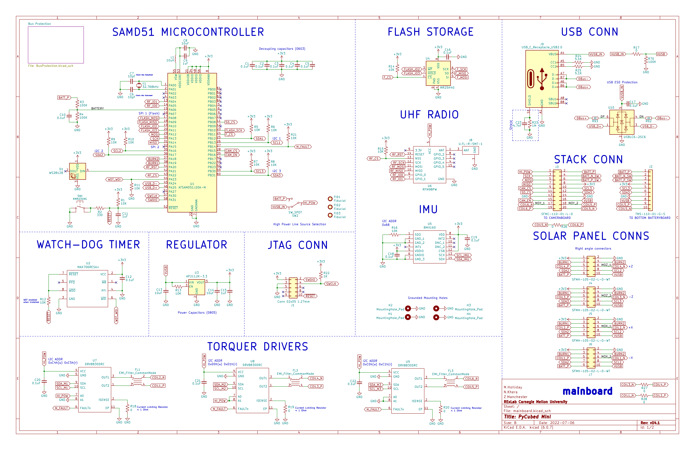

Hardware
========

Pycubed-Mini V5 (B1/02)
------------------------
Microcontroller: ATSAMD51J19A

IMU: BMX160

RTC: Adafruit PCF8523

Pycubed-Mini V4
----------------

Microcontroller: ATSAMD51J19A

IMU: BMX160

Pycubed-Mini V2
----------------

Microcontroller: ATSAMD51J20A
